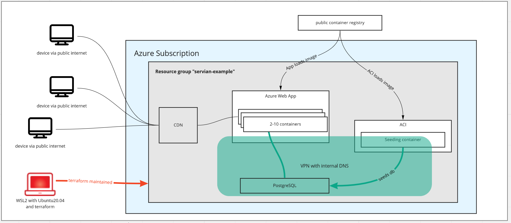

# servian-example

## Architecture



The application is deployed via a local computer with Ubuntu 20.04 and terraform into an empty Azure subscription. Terraform creates a resource group with a web app including CDN and a database, as well as an ACI with a separate docker container to seed the database. Docker images for web app and ACI are sourced from the public docker registry. All internal connections between web app, database and ACI are secure via a VNet.

## Prerequisites

* terraform 1.1.7 (see https://www.terraform.io/downloads)
* latest `ac cli` version (see https://docs.microsoft.com/en-us/cli/azure/install-azure-cli-linux?pivots=apt)
* Subscription and its id in Azure.
* WSL2 / Ubuntu-20.04, as the solution is tested in this environment 


## Deploy via (linux) command line

1. Clone repositoy
1. cd into cloned repository
1. Set env variables:
   ```
   export TF_VAR_subscription_id="<azure subscription id>"
   export TF_VAR_db_user="<admin user name for db>"
   export TF_VAR_db_password="<admin password for db>"
   ```
1. `terraform init`
1. `terraform plan`; check for any issues
1. `terraform apply`
1. After about 10 minutes after the terraform command has completed, test if application is accessible and works at https://servian-dc-202203-appservice.azurewebsites.net/
1. After about 90 minutes the CDN should be setup; test if application is available via the CDN (https://awesome-servian-example-app.azureedge.net/)


## Explanations, limits, known issues, assumptions

* The task states we should start from an empty account. I chose to start from an existing subscription instead of creating a new one via terraform, as in Azure usually there would be one default subscription already upon creation of an account.
* I worked with a "main" branch + feature branches as well as PRs, but also committed to "main" occasionally. This seemed reasonable for me working alone on the project and still achieving a level of traceability that allows judging my work style. In a larger setting I might work with an additional DEV branch and releases and reviewed PRs, or a ready-to-go fully featured concept.
* Settings including secrets pass through docker. That's not ideal, as credentials are stored in clear text in the docker state file. Ideally, the solution would use a managed identity to get the credentials from a key vault. Due to time constraints I decided for the simpler solution.
* Settings including the db password are stored in the "app settings" and can easily be read out. The recommended, more secure alternative is, to reference secrets stored in a key vault. I tried hard, but it just didn't work. As colleagues of mine and myself had similar issues with referenced secrets in the past, I gave up, considering the time constraints, and left the secrets in the app settings.
* Some values are globally unique: the app name and its domain, etc. This means, that the application with this code can be installed only once. As someone has to test and inspect this code, I tried to keep the "run instructions" as simple as possible (3 variables are much easier to configure than 30), but those names are still changeable via tf variables.
* I seed the db with the help of an ACI container that runs only once. While it fulfils the purpose, a solution with more observability (did seeding work? if not, why did it fail?) would be desireable.
* I was not sure if the golang web server is production stable and secure. I assume one might check this in a real-life scenario and possibly combine it with nginx or apache2, or a better WAF.

## Requirement Checklist

- [x] Works in **empty cloud subscription**: _Yes; tf code creates a resource group in the given subscription._
- [x] Use **release package**; do not compile _Yes; uses pre-built docker image_
- [x] Not connected to a particular **cloud account** _Correct; needs a subscription id as a parameter / variable_
- [x] **Regular commits**; git workflow _Used feature branches + PRs; not really perfect, but probably good enough. It is hard to use proper branching strategies when working with terraform, because the long running "apply" commands require asynchronous working, often based on the latest changes._
- [x] **Documentation**: Pre-requisites
- [ ] **Documentation**: High-Level Architecture
- [x] **Documentation**: Process instructions for provisioning
- [x] Able to **start from a cloned git repo** _Yes; to be cloned into Ubuntu20.04 via WSL. Github actions would have been more fun though._
- [x] **Pre-requisites** clearly documented
- [x] Contained **within a github repo** _Yes; actually it's one file._
- [x] Deploys via **automated process** _Yes; all via terraform. ACI is probably not the ideal solution for seeding, but a good compromise in terms of keeping it all simple._
- [x] Deploys **infrastructure using code** _Yes; infrastructure is defined via terraform._
- [x] Code is **clear** _In my opinion it is; I tried to make it as readable as possible._
- [x] Code contains **comments** _Yes; a lot._
- [x] Coding is **consistent** _That's subjective - I think it is, but I assume that if I had attended a terraform course, it would be even more consistend._
- [x] **Security**: Network segmentation? VNet is created to secure the unencrypted communication between the db and the application
- [x] **Security**: Secret storage _Secrets are stored in
    - environment variables in the ACI container
    - the web app settings; this is not ideal - a key vault would be better, but cannot be linked in this setup
    - environment variables on the local computer
    - the terraform state on the local computer; keeping the tf state local helps protecting the secrets; another option would be to store the tf state in an encrypted, dedicated storage account
- [x] **Security**: Platform security features _Used VNets; additional features like web application firewall could have been used._
- [x] **Simplicity**: No superfluous dependencies _To my best knowledge the code contains only the bare necessities._
- [x] **Simplicity**: Not over engineered _Right; deliberately chosen the solution that was advertised on Microsofts website as a low-effort way to bring an app into the cloud - and not k8s (I am also not confident in k8s administration)._
- [x] **Resiliency**: Auto scaling _Yes; configured to run on up to 10 instances and could be on more with a better app plan, although the current app would probably not really need it._
- [x] **Resiliency**: Highly available frontend _Yes; achieved via CDN. Would probably not make much sense for this app, and there would be optimization opportunities like "Dynamic Site Acceleration (DSA)", but for the purpose of a demonstration the MS standard CDN should be good enough._
- [x] **Resiliency**: Highly available database
